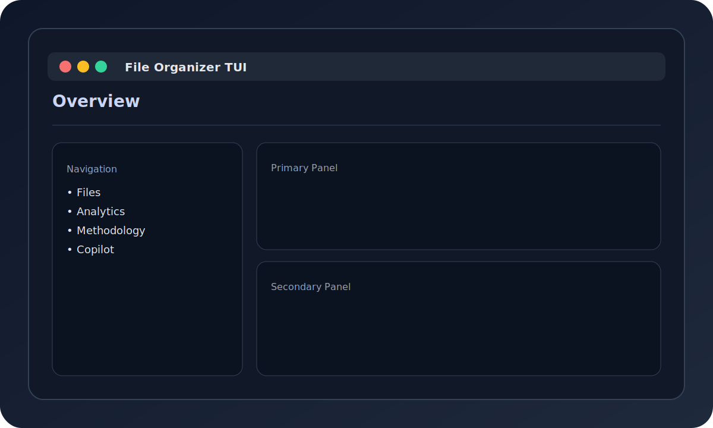

# File Organizer v2.0

[](https://github.com/curdriceaurora/Local-File-Organizer/actions/workflows/ci.yml)
[](docs/USER_GUIDE.md)

> AI-powered local file management. Privacy-first -- runs 100% on your device.

**307 tests** | **334 modules** | **48+ file types** | Python 3.11+

## Features

- **AI-Powered Organization**: Qwen 2.5 3B (text) + Qwen 2.5-VL 7B (vision) via Ollama
- **Audio Transcription**: Local speech-to-text with faster-whisper (GPU-accelerated)
- **Video Analysis**: Scene detection and keyframe extraction
- **Copilot Chat**: Natural-language assistant -- "organize ./Downloads", "find report.pdf", "undo"
- **Organization Rules**: Automated sorting with conditions, preview, and YAML persistence
- **Terminal UI**: 8-view Textual TUI (Files, Analytics, Audio, History, Copilot, and more)
- **Web UI**: Browser-based interface via FastAPI and HTMX
- **Full CLI**: Organize, rules, suggest, dedupe, daemon, analytics, update, profiles
- **Auto-Update**: GitHub Releases checks with verified downloads and rollback
- **Intelligence**: Pattern learning, preference tracking, smart suggestions, auto-tagging
- **Deduplication**: Hash and semantic duplicate detection
- **Undo/Redo**: Full operation history
- **PARA + Johnny Decimal**: Built-in organizational methodologies
- **Cross-Platform**: macOS (DMG), Windows (installer), Linux (AppImage) executables

## Screenshots




## Quick Start

```bash
pip install -e .

# Pull models
ollama pull qwen2.5:3b-instruct-q4_K_M
ollama pull qwen2.5vl:7b-q4_K_M

# Organize files (dry run first)
file-organizer organize ./Downloads ./Organized --dry-run

# Launch the TUI
file-organizer tui
```

## Web UI (Preview)

Start the FastAPI server and open the UI:

```bash
uvicorn file_organizer.api.main:app --reload
```

Then visit `http://localhost:8000/ui/` for the HTMX interface.

## Documentation

- [User Guide](docs/USER_GUIDE.md)
- [CLI Reference](docs/cli-reference.md)
- [Configuration Guide](docs/CONFIGURATION.md)
- [Troubleshooting](docs/troubleshooting.md)
- [Getting Started](docs/getting-started.md)

## Optional Feature Packs

| Pack | Install Command | Features |
|------|----------------|----------|
| Audio | `pip install -e ".[audio]"` | Speech-to-text (faster-whisper, torch) |
| Video | `pip install -e ".[video]"` | Scene detection (OpenCV, scenedetect) |
| Dedup | `pip install -e ".[dedup]"` | Image deduplication (perceptual hashing) |
| Archive | `pip install -e ".[archive]"` | 7z and RAR archive support |
| Scientific | `pip install -e ".[scientific]"` | HDF5, NetCDF, MATLAB formats |
| CAD | `pip install -e ".[cad]"` | DXF and CAD format support |
| Build | `pip install -e ".[build]"` | Executable packaging (PyInstaller) |
| All | `pip install -e ".[all]"` | Everything above |

### Audio system dependencies

For full audio format support, the `[audio]` pack uses **FFmpeg** (all platforms) and optionally **CUDA + cuDNN** (NVIDIA GPU users).

**FFmpeg** — required for non-`.wav` formats (MP3, M4A, FLAC, OGG); optional if you only transcribe raw `.wav`:

```bash
# macOS
brew install ffmpeg

# Ubuntu / Debian
sudo apt install ffmpeg

# Windows (winget)
winget install ffmpeg
```

**CUDA + cuDNN** — optional, for significantly faster transcription (see [faster-whisper benchmarks](https://github.com/SYSTRAN/faster-whisper) for hardware-specific numbers):

```bash
# Install CUDA Toolkit from https://developer.nvidia.com/cuda-downloads
# Install cuDNN from https://developer.nvidia.com/cudnn

# Verify the full transcription backend (not just PyTorch)
python3 -c "from faster_whisper import WhisperModel; print('faster-whisper OK')"
python3 -c "import torch; print('CUDA:', torch.cuda.is_available())"
```

**Fallback behavior**: without FFmpeg, only `.wav` files are transcribed; other formats are organized by filename/metadata but not content-analyzed. Without CUDA, transcription runs on CPU (slower but fully functional).

See the [Installation Guide](docs/admin/installation.md) for troubleshooting and advanced configuration.

## Development

```bash
# Run tests
pytest

# Lint
ruff check src/
```

## Configuration

Config lives in `config/file-organizer/config.yaml` relative to your config home. Override with `FILE_ORGANIZER_CONFIG`.

---

**Status**: Alpha | **Version**: 2.0.0-alpha.1 | **Last Updated**: 2026-03-01
