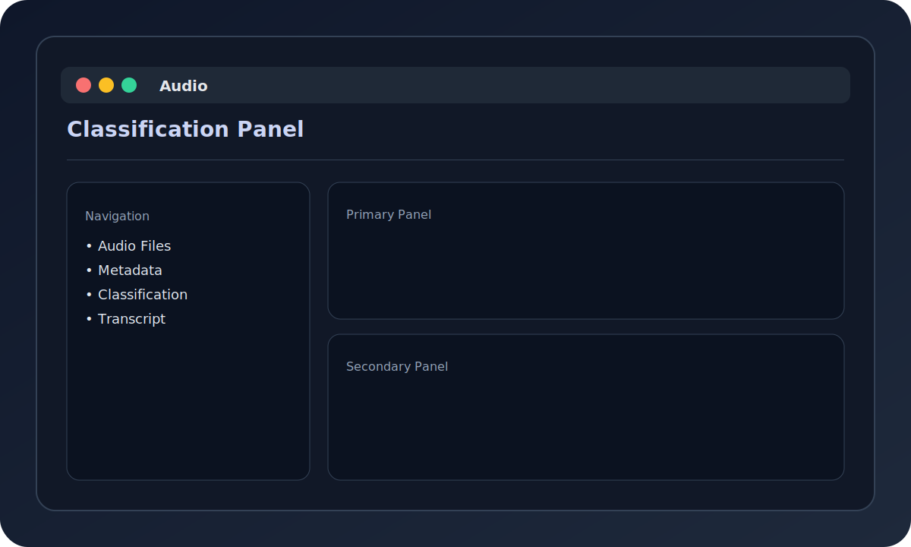

# Terminal User Interface (TUI)

> **Version**: 2.0.0+

File Organizer includes a full-featured Terminal User Interface (TUI) built with [Textual](https://textual.textualize.io/). It provides an interactive, keyboard-driven experience for organizing files without leaving your terminal.

## Overview


*The TUI provides a rich terminal experience with a file browser, live organization preview, and integrated AI copilot.*

## Demo


*Navigating the TUI: browsing files, selecting an organization methodology, previewing changes, and applying.*

---

## Launching the TUI

```bash
# Launch the TUI
file-organizer tui

# Short alias
fo tui

# Launch with a specific directory
file-organizer tui --path ~/Downloads
```

---

## Key Views

### 1. File Browser

Browse and manage your files with a full-featured file manager:

- **Navigation**: Arrow keys to move, `Enter` to open folders
- **Selection**: `Space` to select/deselect files, `a` to select all
- **Preview**: Side panel shows file metadata and content preview
- **Sorting**: Sort by name, size, date, or type
- **Filtering**: Filter by extension or search by name

### 2. Organization Preview


Before applying any changes, the TUI shows a live preview of what will happen:

- Side-by-side view: current location vs. proposed location
- Colour-coded changes: moves (blue), renames (yellow), new folders (green)
- Confidence score for each AI suggestion
- Ability to accept, reject, or edit individual suggestions

**Keyboard shortcuts**:

| Key | Action |
|-----|--------|
| `p` | Toggle preview panel |
| `a` | Accept all suggestions |
| `r` | Reject selected suggestion |
| `e` | Edit suggestion manually |
| `Enter` | Apply accepted changes |

### 3. Methodology Selector

Choose and configure your organization methodology:

- **PARA**: Projects, Areas, Resources, Archives
- **Johnny Decimal**: Hierarchical numbered system
- **Custom**: Rule-based organization

Switch methodology mid-session without losing your file selection.

### 4. Analytics Dashboard


Monitor your file organization at a glance:

- Storage breakdown by file type and age
- Duplicate file summary with space savings estimate
- Recent activity log
- Organization health score

### 5. Audio Panel



Dedicated view for audio file management:

- Waveform preview (for supported formats)
- Transcription display (powered by faster-whisper)
- Metadata editor (artist, album, genre, year)
- Batch organize by genre or date

### 6. AI Copilot Chat


Natural language interface for file organization:

- Type commands like *"organize all PDFs by year"*
- Ask questions like *"which files haven't been accessed in 6 months?"*
- Save custom rules from chat conversations
- Multi-turn conversations with context awareness

**Example prompts**:

```text
> Organize all invoices in ~/Downloads by year and month
> Find duplicate images in ~/Photos
> Move all files older than 2 years to the archive folder
> Rename all meeting notes to include the date
```

**Workflow Integration Payloads**

When the copilot exports a file via workflow integration, it generates launcher-compatible JSON payloads (see `WorkflowIntegration` in `src/file_organizer/integrations/workflow.py`):

*Alfred payload:*

```json
{
  "items": [
    {
      "arg": "/home/user/Documents/report.pdf",
      "subtitle": "Quarterly financial report",
      "title": "report.pdf",
      "uid": "report-20260301T120000Z"
    }
  ]
}
```

*Raycast payload:*

```json
{
  "generated_at": "2026-03-01T12:00:00Z",
  "metadata": {
    "summary": "Quarterly financial report"
  },
  "name": "Open report.pdf",
  "path": "/home/user/Documents/report.pdf"
}
```

Payloads are written to `~/.config/file-organizer/integrations/workflow/`.

### 7. Undo / Redo History

Full undo and redo support for all file operations:

- Step through every operation with `u` (undo) and `y` (redo)
- History persists across sessions
- Filter history by date, file type, or operation type
- Export history as a CSV or JSON log

---

## Keyboard Shortcuts

### Global

| Key | Action |
|-----|--------|
| `q` / `Ctrl+c` | Quit |
| `?` | Show help |
| `Tab` | Switch panel focus |
| `1`–`8` | Jump to view |

### File Browser

| Key | Action |
|-----|--------|
| `↑` / `↓` | Navigate files |
| `Enter` | Open folder / preview file |
| `Space` | Select / deselect |
| `a` | Select all |
| `d` | Deselect all |
| `/` | Search / filter |
| `s` | Sort menu |
| `o` | Organize selected files |
| `Delete` | Move to trash |

### Organization Preview

| Key | Action |
|-----|--------|
| `p` | Toggle preview |
| `a` | Accept all |
| `r` | Reject selected |
| `e` | Edit suggestion |
| `Enter` | Apply changes |

### Copilot

| Key | Action |
|-----|--------|
| `c` | Open copilot |
| `Esc` | Close copilot |
| `Enter` | Send message |
| `↑` / `↓` | Browse message history |

---

## TUI Configuration

Customize the TUI in your config file (`~/.config/file-organizer/config.yaml`):

```yaml
tui:
  theme: dark          # dark | light | auto
  show_hidden: false   # Show hidden files
  preview_panel: true  # Show preview panel by default
  sort_by: name        # name | size | date | type
  sort_order: asc      # asc | desc
  auto_preview: true   # Auto-preview on file selection
  copilot_enabled: true
```

---

## Accessibility

The TUI follows terminal accessibility standards:

- Full keyboard navigation — no mouse required
- Screen reader compatible via terminal emulator
- High-contrast mode available (`--theme high-contrast`)
- Configurable font size via terminal settings

---

## Troubleshooting

### TUI Won't Launch

```bash
# Check Textual is installed
python3 -c "import textual; print(textual.__version__)"

# Reinstall if needed
pip install "local-file-organizer[tui]"
```

### Display Issues

```bash
# Check terminal supports colours
echo $TERM   # Should be xterm-256color or similar

# Force 256 colour mode
TERM=xterm-256color file-organizer tui
```

### Slow Performance

- Use `--no-preview` to disable file preview for large directories
- Set `auto_preview: false` in config
- Limit directory depth with `--max-depth 3`

---

## Related

- [CLI Reference](cli-reference.md) — Full command-line reference
- [Getting Started](getting-started.md) — Installation and first run
- [FAQ](faq.md) — Common questions
