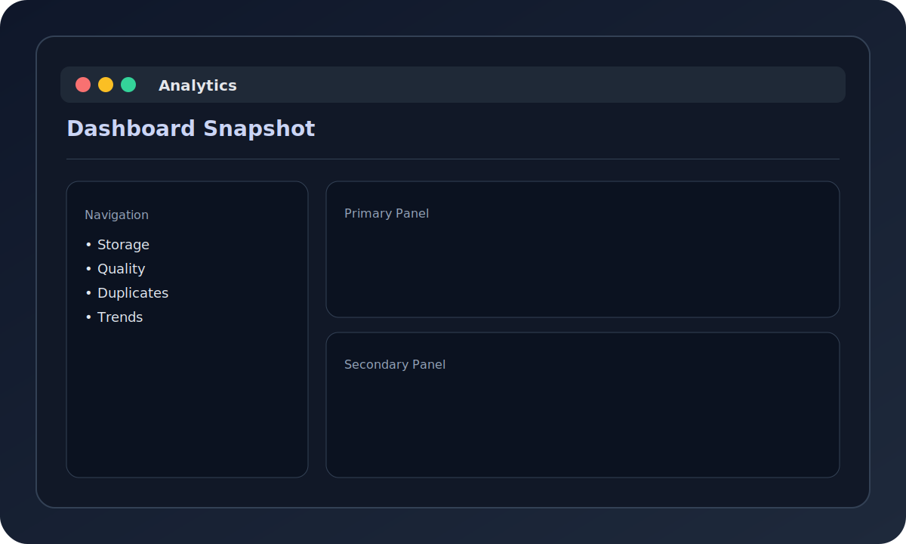

# Analytics Overview



The analytics view summarizes storage usage, file distribution, quality scores, and dedupe impact.

## CLI Report

```bash
file-organizer analytics ./
```

Add `--verbose` for more detail.

## TUI Dashboard

1. Launch the TUI: `file-organizer tui`.
2. Press `3` to switch to Analytics.
3. Press `r` to refresh the dashboard.
