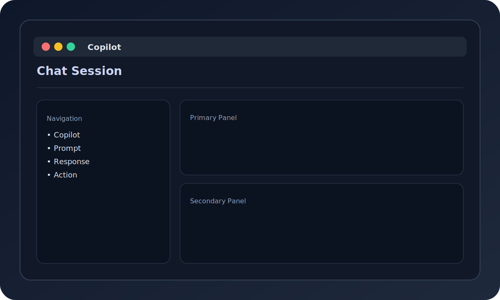

# Copilot Workflow



The copilot provides a natural-language interface for organizing, finding, and undoing file operations.

## Interactive Session

```bash
file-organizer copilot chat
```

Example conversation:

```
You> organize ./Downloads into ./Organized
Copilot> Organized 42 files (3 skipped, 0 failed).

You> undo
Copilot> Last operation undone.

You> find budget.xlsx
Copilot> Found 2 files matching "budget.xlsx".
```

## Single-Message Command

```bash
file-organizer copilot chat "preview ./Downloads"
```

## Tips

- Keep commands short and precise.
- Use `undo` if you want to revert the last operation.
- Pair with `--dry-run` in CLI commands if you want preview-only workflows.
