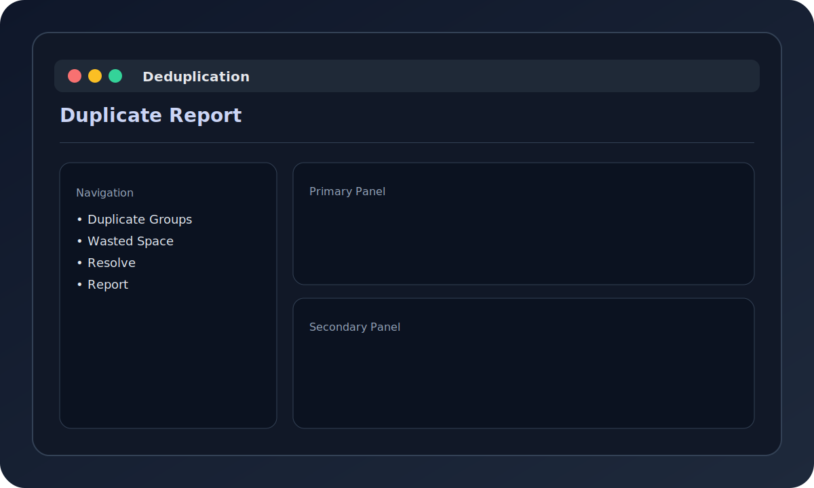

# Deduplication Quickstart



The dedupe CLI helps detect and resolve duplicate files using hash-based scans.

## Scan for Duplicates

```bash
file-organizer dedupe scan ./Documents --recursive
```

## Generate a Summary Report

```bash
file-organizer dedupe report ./Documents
```

## Resolve Duplicates (Dry Run)

```bash
file-organizer dedupe resolve ./Documents --strategy newest --dry-run
```

## Resolve Duplicates (Apply)

```bash
file-organizer dedupe resolve ./Documents --strategy newest
```

Strategies include `manual`, `oldest`, `newest`, `largest`, and `smallest`.
